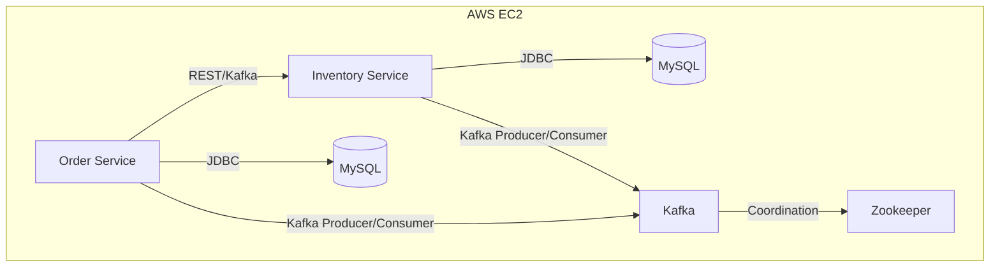

# Microservices Order Management System

[](https://your-ci-link)
[](https://your-coverage-link)

## Overview
A cloud-ready, production-grade Order Management System built using Java 17, Spring Boot 3, Docker, Kafka, MySQL, and Maven. The system is designed with a microservices architecture for scalability, maintainability, and ease of deployment.

## Architecture



- **common-dto**: Shared Data Transfer Objects for consistent communication between services.
- **order-service**: Handles order creation, management, and persistence. Communicates with inventory-service and emits/consumes Kafka events.
- **inventory-service**: Manages inventory stock, updates, and persistence. Listens to order events and updates inventory accordingly.

## Features
- Modular Maven multi-module structure
- RESTful APIs for order and inventory management
- Asynchronous event-driven communication using Kafka
- Centralized DTOs for type safety and reusability
- Containerized microservices with Docker
- Orchestrated with Docker Compose for local and cloud deployments
- Automated CI/CD pipeline with Jenkins, deploying to AWS EC2
- Environment-specific configuration using Spring profiles
- Health checks and dependency management for robust orchestration

## Technology Stack
- Java 17
- Spring Boot 3.1.4
- Maven
- Docker & Docker Compose
- MySQL 8
- Apache Kafka & Zookeeper
- Jenkins (CI/CD)
- AWS EC2 (Deployment)

## API Documentation

### Order Service
Base URL: `/api/orders`

| Method | Endpoint         | Description                |
|--------|------------------|----------------------------|
| GET    | /all             | Get all orders             |
| GET    | /{id}            | Get order by ID            |
| POST   | /create          | Place a new order          |

**Example: Place Order**
```http
POST /api/orders/create
Content-Type: application/json
{
  "customerId": 1,
  "items": [
    { "skuCode": "1001", "quantity": 2 }
  ]
}
```

### Inventory Service
Base URL: `/api/inventory`

| Method | Endpoint                        | Description                          |
|--------|----------------------------------|--------------------------------------|
| POST   | /create                         | Add new inventory item               |
| GET    | /all                            | Get all inventory items              |
| GET    | /{skuCode}                      | Get inventory by SKU code            |
| PUT    | /update/increment/{skuCode}     | Increment quantity & update price    |

**Example: Increment Inventory**
```http
PUT /api/inventory/update/increment/1001?quantity=5&pricePerItem=10.0
```

## Getting Started

### Prerequisites
- Docker & Docker Compose
- Java 17
- Maven

### Build & Run Locally
```bash
# Build all modules
mvn clean install

# Start all services using Docker Compose
cd microservices-order-management-system

docker-compose -f docker-compose.aws.yml up --build
```

### Accessing Services
- **Order Service**: http://localhost:8081
- **Inventory Service**: http://localhost:8082
- **MySQL**: localhost:3307 (user: root, password: root)
- **Kafka**: localhost:9092

## CI/CD Pipeline
- Jenkins pipeline automatically builds, tests, and deploys the project to AWS EC2.
- Uses Docker images for each service, pushed to Docker Hub.
- Environment variables and secrets are managed securely via Jenkins and AWS best practices.

## Configuration
- Environment-specific configs are managed via Spring profiles (e.g., `aws`).
- Sensitive data (DB credentials, Kafka config) should be set via environment variables or externalized config.

## Health Checks & Monitoring
- MySQL service includes a health check in Docker Compose.
- Spring Boot Actuator can be enabled for additional health and metrics endpoints.
- Recommended: Integrate centralized logging and monitoring (e.g., ELK, Prometheus, Grafana).

## Extending the System
- Add new microservices by creating new Maven modules and updating Docker Compose.
- Use the shared `common-dto` module for consistent data contracts.
- Integrate with other cloud services as needed (e.g., AWS RDS, S3).

## Contribution Guidelines
- Fork the repository and create a feature branch.
- Write clear, concise commit messages.
- Ensure all tests pass before submitting a pull request.
- Follow the existing code style and structure.

## Future Improvements
- Add Swagger/OpenAPI documentation for all endpoints.
- Implement distributed tracing (e.g., OpenTelemetry).
- Add role-based authentication and authorization.
- Integrate with cloud-native managed services (e.g., AWS RDS, MSK).
- Expand test coverage and add performance tests.

## Best Practices Followed
- Clean separation of concerns and modular design
- Automated, reliable deployments
- Secure configuration management
- Robust error handling and observability

## License
[MIT](LICENSE)

---
*For interviewers: This project demonstrates advanced microservices architecture, CI/CD automation, cloud deployment, and best practices in Java enterprise development.*